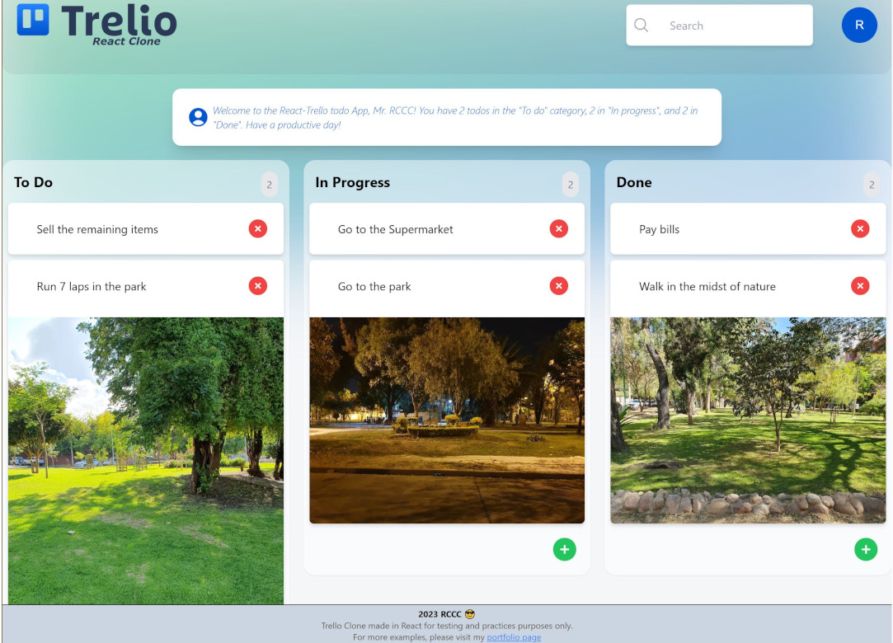

# Trello - React.

A Trello like app with functionality to create tasks and categorize them in three different categories: To Do, In progress, and Done.

See it: https://trello-react-psi.vercel.app/

## Screenshots:

<div align="center">
  
</div>

## Features.

- Drag and Drop functionality. The user can add and/or delete the tasks in each category as well as move the tasks among the categories according the their state with Drag and Drop functionality powered by [beautiful-dnd](https://github.com/atlassian/react-beautiful-dnd).
- Data persistence. The tasks, along with their categories and order are stored in a database powered by
  [https://cloud.appwrite.io/](AppWrite Cloud). Therefore, everytime the page is loaded, the app will retrieve the to-dos lists and their status in realtime from the database.
- OenAI's ChatGPT integration. Through [https://platform.openai.com/](Open AI) send the to-dos list to ChatGPT and ask to provide a brief summary of tasks count by category.
- State management powered by [Zustand](https://www.npmjs.com/package/zustand).
- Search functionality. Search for a task and filter the todos lists in realtime as you type in the search box.

## Technologies:

The following technologies, dependencies, and services were used to make this app:

- ReactJS.
- NextJS.
- TailwindCSS.
- [AppWrite Cloud](https://cloud.appwrite.io/). A secure open-source backend platform which provides a set of secure APIS, tools and a management console UI to help build apps quickly. Features used: database and file storage.
- [React-Beautiful-DND](https://github.com/atlassian/react-beautiful-dnd). A beautiful and accessible drag and drop library for lists with React.
- [Zustand](https://www.npmjs.com/package/zustand). A small, fast and sacalable bearbones state-management solution using simplified flux principles.
- [OpenAI API](https://platform.openai.com/). With this API we can access OpenAI's GPT (generative pre-trained transformer) models by sending instructions and receiving answers in natural text language. In this specific app, we send the To-dos list and ask ChatGPT to provide a simple count summary with of the to-dos in each category.
- [React-Avatar](https://www.npmjs.com/package/react-avatar). A useful library to generate avatars based on a given user information/username.

This is a [Next.js](https://nextjs.org/) project bootstrapped with [`create-next-app`](https://github.com/vercel/next.js/tree/canary/packages/create-next-app).

## Getting Started

First, run the development server:

```bash
npm run dev
# or
yarn dev
# or
pnpm dev
```

Open [http://localhost:3000](http://localhost:3000) with your browser to see the result.

You can start editing the page by modifying `app/page.tsx`. The page auto-updates as you edit the file.

This project uses [`next/font`](https://nextjs.org/docs/basic-features/font-optimization) to automatically optimize and load Inter, a custom Google Font.

## Learn More

To learn more about Next.js, take a look at the following resources:

- [Next.js Documentation](https://nextjs.org/docs) - learn about Next.js features and API.
- [Learn Next.js](https://nextjs.org/learn) - an interactive Next.js tutorial.

You can check out [the Next.js GitHub repository](https://github.com/vercel/next.js/) - your feedback and contributions are welcome!

## Deploy on Vercel

The easiest way to deploy your Next.js app is to use the [Vercel Platform](https://vercel.com/new?utm_medium=default-template&filter=next.js&utm_source=create-next-app&utm_campaign=create-next-app-readme) from the creators of Next.js.

Check out our [Next.js deployment documentation](https://nextjs.org/docs/deployment) for more details.
